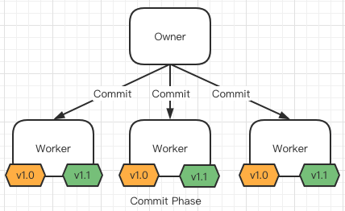

# TiValve

PingCAP TiFlow 插件系统（TiDB Hackathon 2022 参赛项目）

## 简介

[项目背景和动机](https://github.com/mischaZhang/cdc-plg#%E8%83%8C%E6%99%AF%E5%8A%A8%E6%9C%BA)

## 功能与实现

TiFlow 是一个集数据采集（DM）和数据抽取（TiCDC）的数据流处理系统，其中有比较多的功能点可进行插件化改造。当前项目首先考虑将插件系统引入 TiCDC 的 Sink 模块，以实现灵活地对接自定义下游数据源的应用场景。

与此同时，插件系统的实现也有多种方式，包括但不限于 WebAssembly、Lua、Go Plugin、RPC。当前代码仓库以 WebAssembly 为例，提供了一个实现思路，并实际编写了一个自定义 Sink。

### 整体架构

TiCDC 整体的数据处理流程如下图所示：


### 处理流程

TiCDC 抽象出了 Sink 接口，可将表结构变更和表数据变更事件推送到 Sink 中：

```go
type Sink interface {
    AddTable(tableID model.TableID) error
    EmitRowChangedEvents(ctx context.Context, rows ...*model.RowChangedEvent) error
    EmitDDLEvent(ctx context.Context, ddl *model.DDLEvent) error
    FlushRowChangedEvents(ctx context.Context, tableID model.TableID, resolved model.ResolvedTs) (model.ResolvedTs, error)
    EmitCheckpointTs(ctx context.Context, ts uint64, tables []model.TableName) error
    RemoveTable(ctx context.Context, tableID model.TableID) error
    Close(ctx context.Context) error
}
```

TiCDC 自身提供了 MySQL 和 Kafka 这两种 Sink 实现，我们需要为此接口实现另一种实现：`WasmPluginSink`。

我们使用 [waPC](https://wapc.io/) 作为 Wasm 的 Host 端和 Guest 端的通信协议，并且为了实现简单，使用 JSON 作为序列化协议。

waPC的 Instance 通信接口声明为：

```go
Instance interface {
    MemorySize(context.Context) uint32
    Invoke(ctx context.Context, operation string, payload []byte) ([]byte, error)
    Close(context.Context) error
}
```

因此，在 Host 端，我们只需要为 Sink 接口中的每个函数声明一个唯一名称的 `guest_call`，然后在 Guest 端注册并实现相应的处理逻辑。

Guest 端可基于底层的 WASI 规范的 API 来访问 OS 资源，从而实现自定义业务逻辑。然而，由于 Sink 接口向 Guest 端传递的均为 **数据变更事件** 的信息，在执行一些复杂的业务处理（比如：基于表结构做一些判断，对数据进行修正或过滤）时就显得力不从心了，后面我们还需要在 Host 端提供一些 `host_call` 供 Guest 端访问，从而增强自定义处理能力。整体的处理流程如下图所示：


### 插件管理

TiCDC 集群采用 Master-Worker 工作模式，每个 TiCDC 进程是无状态的，基于 pd 内置的 etcd 选举出全局唯一 Owner 节点负责对 Changefeed 进行统一调度，将 Changefeed 划分为 TablePipeline 这个最小同步单元之后，分发到不同的 Processor 节点上执行，执行过程中的状态信息保存到 pd 上。整个集群的所有角色节点都是高可用的。

无插件体系时，TiCDC 集群中的所有 TiCDC 进程运行的 bin 文件版本均是相同的，因此对 TiCDC 本身来说不存在状态一致性问题。引入插件体系后，需要保证所有 TiCDC 进程中的插件版本是一致的。

我们提供了一种基于 2PC 的插件变更的实现思路，整个插件变更流程共分为 Prepare、Pause、Commit 三个阶段。

Prepare 阶段：通过 cdc cli 或 OpenAPI 调用上传插件接口，将 插件文件上传至 Owner 节点（如果请求打到 Processor 节点上，会被路由至 Owner 节点）。Owner 节点此时开始执行 Prepare 操作，向所有 Processor 节点分发插件文件，直到所有节点返回成功后，执行下一步 Pause。


Pause 阶段：此阶段会暂停所有正在运行的 Changefeed 任务，等待下一步 Commit 阶段做真正的插件切换操作。


Commit 阶段：对所有的 Changefeed 中的所有 TablePipeline 的 Sink 模块执行 Reload 操作（也可以优化下，只针对使用了 WasmPluginSink 实现的 TablePipeline 执行 Reload），重新初始化 Wasm Instance 时使用新版本的 Wasm 插件文件，从而实现版本更新。



以上三个阶段都是幂等的。

## 进展

目前的 Demo 已实现将 Row Changed Events 数据（只处理 INSERT，不处理 UPDATE）转换为 CSV 格式后写入 Host 本地文件系统。

## 未来

目前只尝试针对 TiCDC Sink 这一个扩展点进行插件化改造，事实上 TiCDC 或者 DM 还有一些其他的扩展点可以挖掘插件能力，在引入更多插件扩展之后，TiFlow 可形成围绕 TiDB 数据库的功能强大的数据流处理生态，在一定场景上取代传统的流处理平台，简化技术架构。
